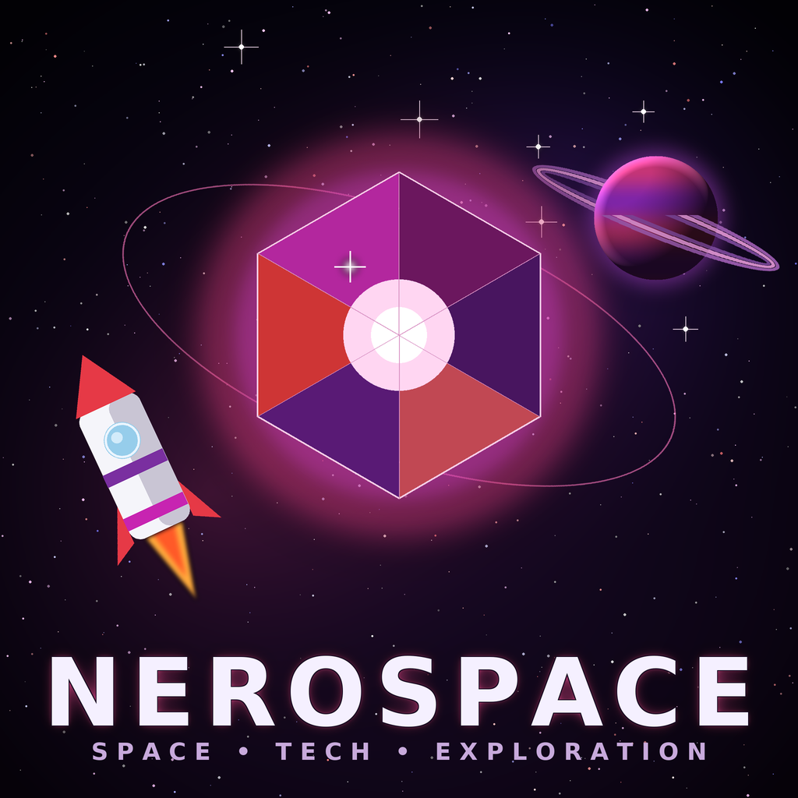

<p align="center">
  
</p>

<h1 align="center">Nerospace</h1>

<p align="center">
  <em>Mine alien ore, power up your machines, and build rockets to leave the planet behind.</em>
</p>

<p align="center">
  
  
  
  
  
</p>

---

## About

Nerospace is a space-exploration and tech-progression mod for Minecraft (Java Edition). It takes the familiar loop of mining and crafting and points it at the sky: dig up a new ore, refine it with machines you build, forge the parts for a rocket, and launch to a whole new world with resources of its own. Every step forward is a step further from the overworld.

The mod is built **standalone** — it requires no other mods — but uses conventional tags and NeoForge capabilities so it's designed to play nicely alongside the wider tech-mod ecosystem.

## The gameplay loop

1. **Find nerosium** — a new ore that generates in the overworld in stone and deepslate variants.
2. **Refine it** — smelt raw nerosium into ingots, or run ore and raw material through the **Nerosium Grinder**, a powered machine that grinds ore into dust for a better yield.
3. **Gear up** — craft the **nerosium pickaxe** (tuned between iron and diamond) and store materials in nerosium / raw-nerosium blocks.
4. **Travel** — work toward leaving the overworld and reach **Greenxertz**, a new planet-dimension.
5. **Explore Greenxertz** — mine **nerosteel** and **xertz quartz**, the planet's own resources, each with its own material chain.
6. **Go bigger** — progress through **tiered rockets** (Tier 1 → 2 → 3), keep them fueled, and set down a launch pad as your departure point.

## Features

- New overworld ore (nerosium + deepslate variant) with worldgen, drops, and tool requirements
- Full material chain: raw material → ingot, dust, and storage blocks
- The **Nerosium Grinder** — an energy-powered processing machine with its own interface
- The **nerosium pickaxe** tool
- A new dimension, **Greenxertz**, with its own ores (**nerosteel**, **xertz quartz**)
- Tiered rockets, a refuelable fuel canister, a launch pad, and an early travel device
- Common tagging (`c:ores/...`, `c:ingots/...`, `c:dusts/...`) for recipe-viewer and cross-mod compatibility

## Requirements

| | |
| --- | --- |
| Minecraft | 26.1.2 |
| Mod loader | NeoForge (`26.1.2.68-beta`) |
| Java | JDK 25 (64-bit) |

## Installing

1. Install the matching **NeoForge** version for Minecraft 26.1.2.
2. Download the Nerospace `.jar` for your version from the Releases page (or CurseForge).
3. Drop the `.jar` into your `mods/` folder and launch.

## Building from source

This project uses the Gradle wrapper (ModDevGradle); no separate Gradle install is needed.

```bash
# Build the mod jar (output in build/libs/)
./gradlew build

# Launch a dev client / server
./gradlew runClient
./gradlew runServer

# Regenerate data-driven assets (models, blockstates, recipes, loot, tags, lang)
./gradlew runData
```

> Models, blockstates, recipes, loot tables, tags, and lang files are produced by **data generation** (`runData`) rather than hand-authored. Block/item textures are generated by the helper scripts in [`tools/`](tools/) and are additive-only (they never overwrite existing art). Editable Blockbench sources live in [`art/blockbench/`](art/blockbench/).

## Project layout

```bash
src/main/java/za/co/neroland/nerospace/
  registry/   central DeferredRegister setups (blocks, items, etc.)
  machine/    the Nerosium Grinder block-entity, menu, and screen
  world/      worldgen features and placement
  item/       custom items (e.g. the travel device)
  datagen/    data providers for all generated JSON
tools/        texture / Blockbench / logo generators
art/          logo and editable Blockbench model sources
```

## Roadmap

Nerospace is actively in development. Planned additions include more planets and rocket tiers, additional machines, custom creatures and atmosphere mechanics, and deeper progression. Issues and feedback are welcome and directly shape what comes next.

## Contributing & feedback

Bug reports and suggestions are welcome via the Issues tab. If you'd like to contribute code, please open an issue first to discuss the change.

## License

Code and original assets are **All Rights Reserved** (© Neroland) unless stated otherwise. Please don't redistribute or republish builds without permission. If you'd like to use part of this project, open an issue to ask.

## Credits

Created by **Neroland**.

> The project logo and some starter block/item textures were created with the help of AI image tools as placeholder art, and are being refined over time.
