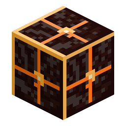

# Block of Cindrite

<!-- nerospace:render -->

<!-- /nerospace:render -->

Compact storage for nine Cindrite gems.

## Overview

A glowing ember-coloured storage block of the Cindara crystal.

## Obtaining

- **Craft:** fill a 3×3 grid with **Cindrite**.
- **Unpack:** craft the block alone to get **9 Cindrite** back.

## Details

- ID: `nerospace:cindrite_block`
- Tool: pickaxe, iron tier · Drops: itself
