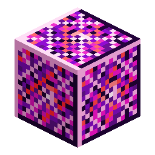

# Block of Nerosium

<!-- nerospace:render -->

<!-- /nerospace:render -->

Compact storage for nine Nerosium Ingots.

## Overview

A decorative + storage block of refined nerosium. Purely for compact storage and building; it has no
machine behaviour.

## Obtaining

- **Craft:** fill a 3×3 grid with **Nerosium Ingots**.
- **Unpack:** craft the block alone to get **9 Nerosium Ingots** back.
- It is also the core ingredient of the **[Rocket Launch Pad](Rocket-Launch-Pad)**.

## Details

- ID: `nerospace:nerosium_block`
- Tool: pickaxe, iron tier · Drops: itself
