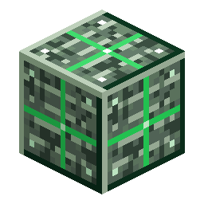

# Block of Nerosteel

<!-- nerospace:render -->

<!-- /nerospace:render -->

Compact storage for nine Nerosteel Ingots.

## Overview

A storage/building block of refined nerosteel. It also appears as a core component in rocket recipes.

## Obtaining

- **Craft:** fill a 3×3 grid with **Nerosteel Ingots**.
- **Unpack:** craft the block alone to get **9 Nerosteel Ingots** back.
- Used as the engine core in the **Tier 1 / 2 / 3 rockets**.

## Details

- ID: `nerospace:nerosteel_block`
- Tool: pickaxe, iron tier · Drops: itself
