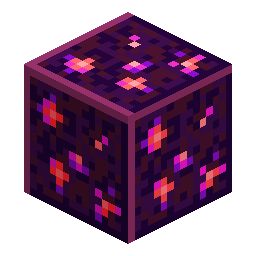

# Block of Raw Nerosium

<!-- nerospace:render -->

<!-- /nerospace:render -->

Compact storage for nine units of Raw Nerosium.

## Overview

Stores unprocessed **Raw Nerosium** in block form — handy for hauling a mining haul before smelting.

## Obtaining

- **Craft:** fill a 3×3 grid with **Raw Nerosium**.
- **Unpack:** craft the block alone to get **9 Raw Nerosium** back.

## Details

- ID: `nerospace:raw_nerosium_block`
- Tool: pickaxe, iron tier · Drops: itself
