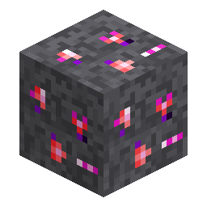

# Deepslate Nerosium Ore

<!-- nerospace:render -->

<!-- /nerospace:render -->

The deepslate-hosted variant of [Nerosium Ore](Nerosium-Ore), found in the lower part of its range.

## Overview

Identical drops and uses to Nerosium Ore, but embedded in deepslate, so it is slightly tougher to mine.

## Obtaining

- **Mining:** requires an **iron-tier pickaxe** or better. Drops **Raw Nerosium** (Fortune-affected).
- **Generation:** the deepslate form of the Overworld nerosium ore deposit (appears where the deposit

  intersects deepslate, in the lower part of the **y −24 to y 56** band).

## Use

Same as [Nerosium Ore](Nerosium-Ore): smelt/blast Raw Nerosium into a **Nerosium Ingot**, or grind it
in a **[Nerosium Grinder](Nerosium-Grinder)** for double yield.

## Details

- ID: `nerospace:deepslate_nerosium_ore`
- Tool: pickaxe, iron tier · Drops: Raw Nerosium
