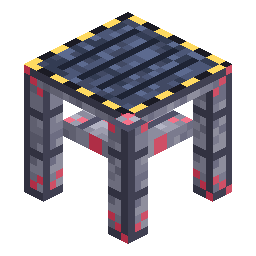

# Launch Gantry

<!-- nerospace:render -->
<p align="right"></p>
<!-- /nerospace:render -->

The boarding tower that turns a 5×5 pad into the **Heavy Launch Complex**.

## Overview

The Launch Gantry is the heavy-launch module: place at least one next to a complete, aligned
**5×5 [Rocket Launch Pad](Rocket-Launch-Pad)** (at pad level) and the cluster forms a **Heavy Launch
Complex** — the departure point for the biggest rockets, and a comfortable boarding ramp for all of
them.

## Obtaining

**Craft** (shaped):

```text
N . N
N I N
N S N
```

`N` = Nerosteel Ingot · `I` = Iron Bars · `S` = [Station Wall](Station-Wall)

## How it works

- **Forming the complex:** a full, aligned **5×5 pad** plus **≥1 Launch Gantry** adjacent at pad

  level = Heavy Launch Complex. Empty-hand right-click any pad block for a **formation report**
  (cluster size, largest square, gantry/fuel modules, and the next missing piece).

- **Boarding:** right-click the gantry to board the deployed rocket directly — no pixel-hunting the

  entity.

- **Tier gating:**
  - **Tier 4** deploys and launches **only** on a Heavy Launch Complex.
  - **Tier 3** accepts the Heavy complex **or** its classic 3×3 + [Station Wall](Station-Wall) ring.
  - Tiers 1–2 are happy on a plain 3×3 (and on the Heavy complex, of course).
  - The checks re-run at launch — breaking the gantry (or pad blocks) under a deployed rocket

    grounds it.

- **Fuelling:** a [Fuel Tank](Fuel-Tank) attached to a Heavy complex pumps at **480 mB/t** (12× the

  base rate) — a Tier 4's 24,000 mB tank fills in under a minute.

## Details

- ID: `nerospace:launch_gantry` · Tool: pickaxe, iron tier · Drops: itself
