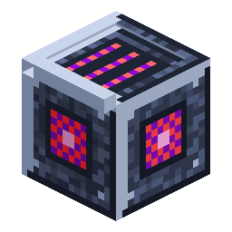

# Nerosium Grinder

<!-- nerospace:render -->
<p align="right"></p>
<!-- /nerospace:render -->

Your first machine — grinds ore into dust to double your metal yield.

## Overview

The Nerosium Grinder processes nerosium inputs into **Nerosium Dust** over time. Since each dust smelts
back into a Nerosium Ingot, grinding ore before smelting **doubles** your ingot output.

## Obtaining

**Craft** (shaped):

```text
I I I
I F I
C C C
```

`I` = Nerosium Ingot · `F` = Furnace · `C` = Cobblestone

## How it works

- **Two slots:** an **input** (top/sides) and an **output** (bottom).
- **Grinding recipes:**
  - Nerosium Ore / Deepslate Nerosium Ore / Raw Nerosium → **2 Nerosium Dust**
  - Nerosium Ingot → **1 Nerosium Dust**
- **Power:** it has an internal energy buffer (10,000 FE) and currently **self-charges**

  (~15 FE/tick), spending ~30 FE/tick while grinding. A full grind takes ~100 progress ticks.

- **Automation:** the inventory is exposed via the item capability — hoppers/pipes can **insert into

  the input from the top or sides and extract dust from the bottom**.

- **GUI:** shows a power gauge and grind-progress; emits a **comparator signal** from its energy level.

## Grinding meteor rock — random space materials

Feed the grinder a **[Meteor Rock](Meteor-Rock)** and it follows a different, random path: instead of a
fixed recipe it produces a weighted-random material drawn from **[Neroland Core](Neroland-Core)'s Meteor
Material Registry**. Every Nero mod registers its grindable materials into Core once, so the pool grows
automatically with whatever mods are installed — the grinder never needs to know about them.

- **What you get:** one **primary** material per rock, plus — occasionally — a bonus **exotic** item.
  Nerospace contributes its raw materials and signature planet ores to the pool.
- **Progression-gated:** an entry only appears once you've reached its **Core gate**. Early game you mostly
  get common dusts; after **Reached Orbit** the rarer materials (Xertz Quartz, Cindrite, Alien Fragments…)
  unlock, and **First Colony** opens the deepest ones (Glacite, Alien Tech Scrap, and the exotic Alien Core).
- **Planet bias:** a planet's **signature ore** is far more likely when you grind *on that planet*. Grind
  on Greenxertz for Xertz Quartz and Raw Nerosteel, on Cindara for Cindrite, on Glacira for Glacite. Off a
  planet (e.g. on Earth) the planet-bound materials drop out of the pool entirely.
- **Operator context:** the gate/planet check uses the **operator** — the last player to open the grinder,
  or the owner of the station it sits in. With no operator online (and no eligible material) the grind
  simply waits, so an unattended grinder never wastes a rock. If the output slot is occupied, extra results
  pop out above the machine.
- **Recipe book:** the random pool is browsable in **JEI** — look up the grinder and the meteor entry shows
  the whole `neroland:meteor/grindable` material set.

Privacy: the registry stores **no player data** — only item metadata. The operator is held by UUID for
gate context only, never logged (POPIA/GDPR).

## Tips

Feed it raw nerosium or ore, pipe the dust into a furnace array, and you get 2 ingots per ore instead
of 1. Save your **Meteor Rocks** for the random-material grind — and grind them *on the matching planet*
to bias the roll toward that planet's signature ore.

## Details

- ID: `nerospace:nerosium_grinder` · Tool: pickaxe, iron tier · Drops: itself
