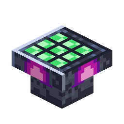

# Passive Generator

<!-- nerospace:render -->
<p align="right"></p>
<!-- /nerospace:render -->

A slow, hands-off trickle of energy from a nerosium core.

## Obtaining

**Craft** (shaped): a nerosteel frame around a Block of Nerosium, wired with Redstone —

```text
N N N
N B N
N R N
```

`N` = Nerosteel Ingot · `B` = Block of Nerosium · `R` = Redstone

## How it works

- **Core slot** (GUI, hand or hopper/pipe fed): raw nerosium, a nerosium ingot, or nerosium dust.
- Each core runs for **20 minutes**, trickling **10 FE/t** (configurable) into a 20,000 FE buffer.
- Extract-only buffer — the pipe network pulls the power out.
- Weaker than the Combustion Generator but ideal as set-and-forget base power.

## Details

- ID: `nerospace:passive_generator` · Tool: pickaxe, iron tier · Drops: itself
- Config: `passiveGeneratorFePerTick`
