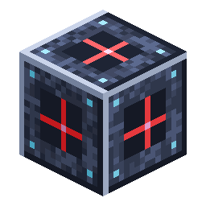

# Quarry Controller

<!-- nerospace:render -->
<p align="right"></p>
<!-- /nerospace:render -->

A BuildCraft-style automated miner: mark out an area with landmarks and the controller builds a
glowing frame and excavates the interior, layer by layer, down to bedrock.

## Overview

The Quarry Controller is the brain of the miner. You mark a rectangular area with **[Quarry
Landmarks](Quarry-Landmark)**, place the controller beside it, give it **frame material** and
**power**, and it:

1. **Builds a frame** — a glowing, see-through structural ring around the claimed rectangle.
2. **Mines** the rectangle's **interior** (the columns under the frame ring are left intact) **layer

   by layer**, top to bedrock, like a 3D printer in reverse — a drill head travels the gantry to each
   block, one block at a time.

3. **Buffers and auto-ejects** everything it digs: mined items into an internal inventory, and any

   liquids it hits into an internal fluid tank — both push out to adjacent storage / pipes.

It never destroys what it can't store: if its buffers fill or the power runs out, it **pauses** (the
GUI tells you why) and resumes on its own once you fix it.

## Obtaining

**Craft** (shaped):

```text
I D I
F R F
I I I
```

`I` = [Nerosteel Ingot](Items) · `D` = Diamond · `F` = [Frame Casing](Upgrade-Modules) ·
`R` = Block of Redstone

> Tier 1 is the craftable version today. Tier 2 / Tier 3 controllers (bigger areas, more module
> slots, harsh-planet access) are planned — see [Tiers & planets](#tiers--planets).

## Setting it up

1. **Place 3 [Quarry Landmarks](Quarry-Landmark) in an L** at the **same Y level** to define the

   corners of the rectangle. The longest side must fit the tier's cap (**Tier 1 = 16×16**).

2. **Place the controller next to / in line with** a landmark — it scans along the axes to find the

   cluster, then **consumes the landmarks** and starts.

> **No landmarks? Outline it yourself.** Frame Casing is placeable: build a **closed rectangle of
> frame blocks** (same Y level, complete perimeter, same size limits) and place the controller
> **beside the ring** — it adopts the outline as its mining area and starts mining right away,
> skipping the frame-building step.

3. **Put [Frame Casing](Upgrade-Modules) in the frame slot** (top-left of the GUI). The frame costs

   **one casing per perimeter cell** (the controller's own cell and any block entities on the
   perimeter are skipped, leaving a gap rather than overwriting them).

4. **Pipe power in** (see below). Building the frame is free, but **mining needs energy**.

## How it works

- **Power:** an internal **200,000 FE** buffer, filled through the energy capability on any side —

  connect a [Universal Pipe](Universal-Pipe) from a [Combustion](Combustion-Generator)/[Passive
  Generator](Passive-Generator) or a [Battery](Battery). **Dig speed scales with the power you
  supply**, up to the tier's per-cycle ceiling × your modules' speed bonus × the planet's speed
  factor. Base cost is **40 FE per block** (lowered by Efficiency modules). The dig is **paced** (a
  work cycle every few ticks) so even with unlimited power it mines at a steady rate, not instantly.

- **Output buffer:** 12 internal slots for mined items; **auto-ejects** into an adjacent inventory /

  pipe. Mining **pauses** ("buffer full") when it can't fit a drop — nothing is ever voided.

- **Fluid buffer:** source liquids (water, lava) in the dig area are **sucked up** into a

  **16,000 mB** internal tank that auto-ejects to an adjacent [Fluid Tank](Fluid-Tank) / pipe.

- **Obstacles:** it **skips** bedrock and other unbreakable blocks, and **skips the entire column**

  under a tile-entity (chests, spawners, machines) so they're left intact. It also skips other
  quarries' frames.

- **Interior only:** it excavates the **inside** of the rectangle and never digs the columns under

  the frame ring, so the frame keeps its footing and the pit walls stay clean.

- **Drill head + gantry:** while it runs, a solid 3-D **gantry** rides the frame — a bridge beam with

  end trucks, a carriage that tracks the dig column, and a support shaft — and a spinning 3-D
  **drill bit** (chuck, flutes, and a glowing tapered tip) descends point-down to the exact block
  being mined.

- **The frame** is a real 3-D structure — glowing corner posts and edge rails with an open,

  see-through centre (so you can watch the dig through it).

- **Far edges:** a large area is force-loaded **one chunk at a time** while actively mining, so the

  dig keeps going as you range its edges; each chunk is released as soon as the dig moves past it (and
  any remainder when it finishes or is removed), so the quarry never pins the whole region — keeping
  memory use and world-save time low.

- **Frame damage:** if a frame block is broken mid-dig (it drops a Frame Casing), the quarry

  **rebuilds the gap** from its casing stock — or **pauses** ("frame incomplete") until you patch
  the ring by hand or insert casings into the frame slots.

- **Reclaiming:** when the dig **finishes**, the frame is dismantled and the standing casings are

  returned to the controller's frame slots. **Breaking the controller mid-dig** instead *orphans*
  the frame: the frame blocks slowly crumble away one by one over the next few minutes (each block
  at its own random moment, roughly 30 s – 4 min by default — tune with `quarryFrameDecayTicks`),
  and **each drops its Frame Casing** as it goes, the same drop as mining it yourself. Placing a
  new controller beside a still-standing ring re-adopts it and stops the decay.

### GUI status lines

| Line | Meaning |
| --- | --- |
| **Idle — set landmarks or frame** | No valid region found yet — place landmarks or a hand-built frame outline. |
| **Building frame** | Placing the frame ring (consuming casings). |
| **Mining** | Digging — `Depth` (right edge of the line, shown while building/mining) counts layers below the frame plane. |
| **Paused — …** | Stopped — the line names the reason: frame incomplete, out of Frame Casing, out of power, output/fluid buffer full, or wrong planet (tier too low for it). The paused drill head stays where the dig stopped. |
| **Finished — frame reclaimed** | Reached bedrock; the frame was dismantled and its casings returned to the frame slots. |

## Tiers & planets

The miner runs **anywhere it has power**, but the harsh outer moons are gated by tier:

| Tier | Max area | Module slots | Base speed | Planets it can mine |
| --- | --- | --- | --- | --- |
| **Tier 1** | 16 × 16 | 1 | 2 blocks/cycle | Overworld, Greenxertz, Orbital Station |
| Tier 2 *(planned)* | 32 × 32 | 2 | 4 blocks/cycle | + **Cindara** |
| Tier 3 *(planned)* | 64 × 64 | 4 | 8 blocks/cycle | + **Glacira** |

Mining **speed/yield also varies per planet** (the dense outer moons mine a little slower). A
too-low tier on a gated planet pauses with "wrong planet".

## Upgrades & the future

- **[Upgrade Modules](Upgrade-Modules)** (Speed / Efficiency / Fortune / Silk Touch) slot into the

  controller and tune its behaviour. They're a **cross-machine** system — the same cards will work
  in other machines.

- **Filters** (whitelist-keep, void the rest — e.g. trash cobble) are a planned follow-up; the

  output pipeline is already built to drop them in.

## Details

- ID: `nerospace:quarry_controller` · Tool: pickaxe, iron tier · Drops: itself (plus its
  buffered items, casings and modules)
- Companion blocks: [Quarry Landmark](Quarry-Landmark), Quarry Frame (placed by the machine or by

  hand from a Frame Casing; always drops a Frame Casing — whether a player breaks it or it decays
  away after its controller is destroyed)

- Capabilities: energy **in** (any side); mined **items out** (any side); **fluid out** (any side).

  The frame-casing and module slots are configuration-only — they can't be piped in or out, so
  automation can never pull your modules or casings (load casings by hand in the GUI)

- Config: scales with the standard `energyRateMultiplier`, `fuelCostMultiplier`, and

  `machineSpeedMultiplier`; `quarryFrameDecayTicks` tunes how slowly an orphaned frame crumbles
  (see [Configuration](Configuration))
