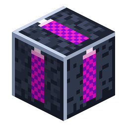

# Quarry Landmark

<!-- nerospace:render -->
<p align="right"></p>
<!-- /nerospace:render -->

A corner marker that defines the area a [Quarry Controller](Quarry-Controller) will mine.

## Overview

Landmarks are how you draw a quarry's footprint. Each one projects animated **marker lasers** along
the horizontal axes; place **three in an L** and the controller reads them as the corners of a
rectangle. They're consumed when the quarry activates.

> Landmarks are optional: you can instead outline the rectangle yourself with hand-placed **frame
> blocks** (Frame Casing is placeable) and put the controller beside the closed ring — see
> [Quarry Controller](Quarry-Controller).

## Obtaining

**Craft** (shaped, makes 3):

```text
R
G
I
```

`R` = Redstone · `G` = Glass · `I` = [Nerosteel Ingot](Items)

## How it works

- **Three landmarks = a box.** Two landmarks "link" when they share a row or column at the same Y

  within range; an L of three gives all four extents of the rectangle.

- **Same Y level.** Place all three at the same height — that height becomes the quarry's reference

  plane (the frame is built there; mining runs from just below it down to bedrock).

- **Within the tier's cap.** The rectangle's longest side must fit the controller's area cap

  (Tier 1 = 16). An oversized or degenerate layout makes the controller pause with "bad region".

- **Binding.** Place the [Quarry Controller](Quarry-Controller) next to / in line with a landmark.

  On activation it scans the cluster, **removes the landmark blocks**, and builds the frame.

- **Cosmetic only otherwise** — the lasers are a client-side effect; landmarks have no inventory or

  power.

## Details

- ID: `nerospace:quarry_landmark` · Tool: pickaxe · Drops: itself
- See [Quarry Controller](Quarry-Controller) for the full mining setup.
