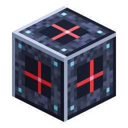
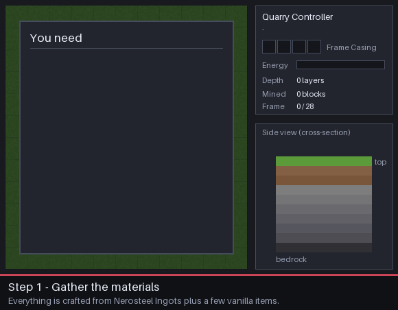

# Quarry Setup Guide

<!-- nerospace:render -->
<p align="right"></p>
<!-- /nerospace:render -->

A step-by-step walkthrough for getting your first [Quarry Controller](Quarry-Controller) digging —
from crafting the parts to collecting the ore. For the full reference (every status line, frame
damage, chunk loading, tiers) see the [Quarry Controller](Quarry-Controller) page.

## At a glance



1. Craft the parts: a controller, landmarks (or extra casings), Frame Casing, and a chest.
2. Mark a rectangle with **3 [Quarry Landmarks](Quarry-Landmark)** in an L, all at the same height.
3. Place the **controller** at that same height, right beside one side of the rectangle.
4. Load **Frame Casing** into the controller — it builds the frame.
5. Connect **power** and an **output chest** — it digs to bedrock and fills the chest.

## 1. Gather the materials

Everything is built from **[Nerosteel Ingots](Items)** (from Nerosteel Ore on Greenxertz), plus a
few vanilla items.

| Part | Recipe | You need |
| --- | --- | --- |
| [Quarry Controller](Quarry-Controller) | 5 Nerosteel Ingot, 1 Diamond, 2 Frame Casing, 1 Block of Redstone | 1 |
| [Quarry Landmark](Quarry-Landmark) | Redstone over Glass over Nerosteel Ingot — makes **3** | 3 (one craft) |
| [Frame Casing](Upgrade-Modules) | 8 Nerosteel Ingot in a ring — makes **4** | see the table below |
| Power source | e.g. [Combustion Generator](Combustion-Generator) or [Passive Generator](Passive-Generator), plus [Universal Pipe](Universal-Pipe) | 1 |
| Output storage | a Chest (or a pipe to your storage) | 1 |

**How much Frame Casing?** The frame is a ring around the rectangle: one casing per perimeter
block, i.e. `2 × width + 2 × length − 4` (one less if the controller sits on the ring itself).

| Area (landmark to landmark) | Blocks mined per layer | Casings | Nerosteel for casings |
| --- | --- | --- | --- |
| 8 × 8 | 6 × 6 | 28 | 56 |
| 16 × 16 | 14 × 14 | 60 | 120 |
| 32 × 32 | 30 × 30 | 124 | 248 |
| 64 × 64 (largest) | 62 × 62 | 252 | 504 |

> **Tip:** the controller has 4 casing slots (256 casings), enough for the largest frame — and
> you get every casing back when the dig finishes, so your first set is reusable.

## 2. Pick the spot

- **Planet:** today's controller is **Tier 1**. It works in the **Overworld**, on **Greenxertz**
  and on the **Orbital Station**. On **Cindara** and **Glacira** it shows *Paused — wrong planet*
  (higher-tier controllers for those moons are planned).
- **Height:** the height you place the landmarks at is the **frame level**. The quarry mines that
  level and **everything below it** down to bedrock. Anything **above** it (trees, hills, your
  house) is left alone — so place the landmarks at ground level, or dig a flat pad first.
- **Size:** each side can be **3 to 64 blocks** long, measured landmark to landmark (servers can
  lower the limit with `quarryMaxSide` — see [Configuration](Configuration)). The outer ring
  becomes the frame, so only the **inside** is mined.
- **Clear the ring:** blocks on the frame ring are **replaced** by frame (without dropping), so
  don't put anything you want to keep on it. Chests and machines on the ring are left in place,
  and anything with a block entity *inside* the area keeps its whole column un-mined.

## 3. Place the landmarks

Place **three landmarks in an L**, **all at the same Y level**:

- one at the **corner**,
- one in a straight line along **X** (east/west) from it,
- one in a straight line along **Z** (north/south) from it.

Those three give the four edges of the rectangle — you don't need a fourth.

```text
  L . . . . . . . L        L = Quarry Landmark
  .               .        . = frame ring (built for you)
  .   mined area  .        C = Quarry Controller
  .               .
  L . . . . . . . . C      <- the controller sits right beside a side,
                              in line with it, at the same Y
```

The landmarks project marker lasers along the ground on their axes, which makes it easy to line
the three up before you go on.

## 4. Place the controller

Place the **Quarry Controller** at the **same Y level** as the landmarks, **directly beside one
side** of the rectangle (touching the edge — not off a diagonal corner). You can also place it
**on the ring itself** — it then takes that frame block's spot.

Within a moment the controller finds the landmarks and **claims the area**. The landmarks are
**used up** (they disappear) and the status changes from *Idle* to *Paused — out of Frame Casing*
or *Building frame*.

> **Still saying "Idle — set landmarks or frame"?** Check that the controller and all three
> landmarks share one Y level, that the controller touches a side (not a corner), and that no side
> is longer than 64 blocks (or your server's `quarryMaxSide`).

### Alternative: no landmarks

Frame Casing is placeable. Instead of landmarks, build a **complete, closed rectangle of frame
blocks** on one level (no gaps, no stray blocks sticking out) and place the controller beside it.
The controller adopts your ring and starts mining right away, skipping the frame-building step.

## 5. Load Frame Casing

Right-click the controller and put **Frame Casing** into the **four slots at the top-left** of the
screen (a hopper or pipe pointed into the controller works too). It places one frame block every half-second, walking the ring. When the ring is done, the
status changes to **Mining**.

## 6. Connect power

Mining costs **40 FE per block** (the frame itself is free). The controller holds 200,000 FE and
accepts energy from **any side** — run a [Universal Pipe](Universal-Pipe) from a generator or a
[Battery](Battery), or put the generator right against it. Energy from other mods' pipes and
generators works too.

A Tier 1 quarry with no modules mines about **4 blocks a second**, using roughly **8 FE/t** — a
single [Combustion Generator](Combustion-Generator) (60 FE/t) or even a [Passive
Generator](Passive-Generator) (10 FE/t) keeps it running. If power runs out it shows
*Paused — out of power* and continues on its own once energy arrives.

## 7. Collect the output

Mined items go into the controller's **12-slot output buffer** and are **pushed automatically into
any chest or inventory touching the controller** (or pulled out by a pipe). If everything is full
it shows *Paused — output buffer full* — **nothing is ever thrown away**; empty the chest and it
continues.

**Liquids:** water and lava source blocks in the area are sucked into a 16,000 mB tank, which is
pushed into a touching [Fluid Tank](Fluid-Tank) or pipe. Liquid that doesn't fit is destroyed so the
dig never stalls. Don't want any of it? Fit an **Evaporator Module** (below).

A good starting layout is controller, chest on one face, power pipe on another — then walk away.

## 8. Optional: upgrade modules

The Tier 1 controller has **one module slot** (to the right of the casing slots). Pick one:

| Module | Effect |
| --- | --- |
| **Speed** | +50% digging speed |
| **Efficiency** | −15% energy per block |
| **Fortune** | Fortune on every block mined (more ore drops) |
| **Silk Touch** | Ores and blocks drop themselves |
| **Evaporator** | Destroys liquids instead of storing them |

Recipes are on the [Upgrade Modules](Upgrade-Modules) page.

## 9. When it finishes

The quarry keeps digging layer by layer until it reaches bedrock (it skips bedrock and anything
else unbreakable). Then it shows **Finished — frame reclaimed**: the frame is taken down and **every
casing goes back** into the controller, ready for the next site. Break the controller — it drops
itself plus the casings, modules and any buffered items — and set it up somewhere new.

> **Moving mid-dig?** Breaking the controller before it finishes leaves the frame behind; those
> frame blocks crumble over a few minutes and each drops its casing. Put a controller back beside
> the ring before then and it picks the dig back up.

## Troubleshooting

| Status | Fix |
| --- | --- |
| **Idle — set landmarks or frame** | Landmarks or controller at different heights, controller not touching a side, a side over the size limit, or an L with only two landmarks. |
| **Paused — out of Frame Casing** | Add more Frame Casing to the top-left slots. |
| **Paused — frame incomplete** | A frame block was broken. Add casings (it rebuilds the gap) or place a casing in the gap yourself. |
| **Paused — out of power** | Connect or add a generator / battery. |
| **Paused — output buffer full** | Put a chest against the controller, or empty the one that's there. |
| **Paused — wrong planet** | Tier 1 can't mine on Cindara or Glacira. |

## See also

[Quarry Controller](Quarry-Controller) · [Quarry Landmark](Quarry-Landmark) ·
[Upgrade Modules](Upgrade-Modules) · [Universal Pipe](Universal-Pipe) ·
[Configuration](Configuration)


<!-- Blank Commit Spot -->