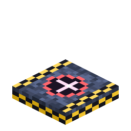

# Rocket Launch Pad

<!-- nerospace:render -->
<p align="right"></p>
<!-- /nerospace:render -->

The mount a rocket is deployed onto before launch — and a safe landing zone.

## Overview

Deploy a **Rocket** (right-click a launch pad with a rocket item) and it appears on the pad, ready to
fuel and fly. The pad also acts as a small **breathable safe zone** so arrivals aren't immediately
punished by the airless atmosphere.

## Obtaining

**Craft** (shaped):

```text
N N N
N B N
N N N
```

`N` = Nerosteel Ingot · `B` = [Block of Nerosium](Block-of-Nerosium)

## How it works

- **Deploy:** right-click the pad with a rocket item to place the rocket entity on it. **A complete,

  aligned 3×3 pad is required** — deploying on a partial pad shows a clear message instead. The same
  check re-runs at launch, so breaking pad blocks under a deployed rocket grounds it.

- **Tier gating:**
  - **Tier 3** additionally requires the 3×3 pad to be **ringed with

    [Station Wall](Station-Wall)** (the 16-block border of the surrounding 5×5, at pad level) —
    **or** a [Heavy Launch Complex](Launch-Gantry); either works.

  - **Tier 4** deploys **only** on the Heavy Launch Complex.
- **Heavy Launch Complex:** a complete, aligned **5×5 pad** plus at least one

  **[Launch Gantry](Launch-Gantry)** module adjacent at pad level. Right-click the gantry to board
  the rocket; empty-hand right-click any pad block for a **formation report** (cluster size, largest
  square, modules present, next missing piece). See [Launch Gantry](Launch-Gantry).

- **Multiblock:** pads placed adjacently form a cluster. A full, aligned **3×3 pad** lets a

  [Fuel Tank](Fuel-Tank) auto-fuel **4× faster** — and a Heavy complex **12× faster** (480 mB/t).

- **Automation proxy:** while a rocket stands on the cluster, every pad block exposes the rocket's

  **fuel-intake slot** as an item capability — point a hopper or a [Universal Pipe](Universal-Pipe)
  (item layer) at any pad block to feed in Rocket Fuel Buckets/Canisters (and pull out the empty
  buckets). A Fuel Tank + pipes on a 3×3 pad fully automates launch prep.

- **Safe zone:** within a few blocks of a pad you can breathe, so you won't suffocate the instant you

  land. Build an [Oxygen Generator](Oxygen-Generator) base for anything beyond the landing area.

## Pad-to-pad travel

Launch pads double as the waypoints of rocket travel.

- **Register a pad:** right-click a pad with a **Name Tag** to commission it as a named travel node
  (the tag's name labels it, or "Pad N"). Registered pads become landing targets.
- **Pick where you land:** in the rocket UI you choose a destination (Home / a planet / the Orbital
  Station), then cycle a **pad selector** to land on a specific registered pad there — or *Nearest* to
  auto-pick. You can also hop **pad-to-pad within the same dimension**.
- **Calculated fuel:** a launch burns a base cost plus **distance** (for a same-world hop) or a flat
  **cross-dimension surcharge**. The cost is shown live in the console; the launch is blocked until the
  tank covers it.
- **Return home:** a rocket remembers the pad it launched from, so flying back lands you on **that
  exact pad**. A **Landing Pod** is only auto-built when the destination genuinely has no launch pad.

## Details

- ID: `nerospace:rocket_launch_pad` · Tool: pickaxe, iron tier · Drops: itself
