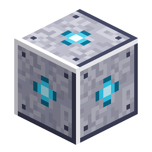

# Station Core

<!-- nerospace:render -->

<!-- /nerospace:render -->

The permanent anchor block of a player-founded station.

## Overview

Every station founded with a **[Station Charter](Station-Charter)** is built around a Station Core at
its centre. The Core marks the station's registration and keeps the whole structure persistent: as long
as it stands, the station is listed as a rocket destination and can be navigated to.

## Obtaining

**Not craftable.** A Station Core is placed automatically when a station is founded (via the charter's
naming screen, or the rocket's *New Station* dock option). It glows softly and is **unbreakable** — the
station is permanent, so your builds inside it are safe.

## How it works

- **Anchor & persistence:** the Core binds the station to its registry slot and survives restarts and
  chunk unloads. The station **never regenerates** once built — any blocks you place or remove inside
  it are preserved on later visits.
- **Rename:** right-click the Core to open a rename console. The new name updates everywhere — the
  rocket dock selector and the station's landing-pad travel node.
- **Founder-locked:** only the player who founded the station can rename it (the founder's ID is stored
  locally for that check only). Anyone can still **fly to** any station.
- **Landing:** flying to this station lands your rocket on the **nearest registered pad to the Core**
  (the airlock's Tier-2 pad by default, or any pad you build closer to the Core).
- **Removing a station:** since the Core is permanent, decommission with the command
  `/nerospace station remove` — stand on the Core, or give a slot from `/nerospace station list`. Only
  the founder (or a creative admin) may remove it.

## Details

- ID: `nerospace:station_core` · Dimension: the station dimension · Unbreakable
