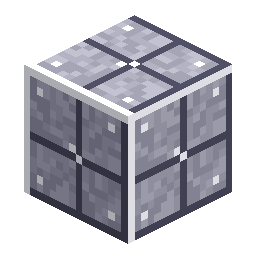

# Station Floor

<!-- nerospace:render -->

<!-- /nerospace:render -->

Metal platform plating for building out the Orbital Station.

## Overview

The **Orbital Station** arrival platform is made of Station Floor, and you craft more to expand your
base in orbit (and anywhere else). A sturdy, blast-resistant deco/building block.

## Obtaining

- **Craft:** a ring of **8 Nerosteel Ingots** around a **Smooth Stone** centre → **8 Station
  Floor**. (The centre plate matters: the same ring with an *empty* centre is the quarry's
  [Frame Casing](Upgrade-Modules), and with an *Iron Ingot* centre it's
  [Station Wall](Station-Wall).)
- The station's starter platform is generated automatically on first arrival (a single shared

  platform — see [Rocket Launch Pad](Rocket-Launch-Pad) / Roadmap).

## Details

- ID: `nerospace:station_floor`
- Tool: pickaxe, iron tier · Drops: itself · High blast resistance
