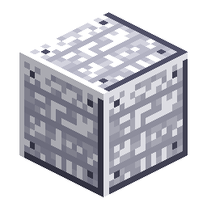

# Station Wall

<!-- nerospace:render -->

<!-- /nerospace:render -->

Hull panelling for the Orbital Station — and a Tier-3 progression gate.

## Overview

Station Wall is the station's wall/hull block. Because it is crafted from station-grade materials, it
also **gates the Tier 3 rocket**: you must reach the Orbital Station (Tier 1) and build station
hull before you can craft a Tier 3 rocket.

## Obtaining

- **Craft:** a ring of **8 Nerosteel Ingots** around an **Iron Ingot** core → **8 Station Wall**.

## Use

- Building/sealing pressurised rooms — like all full opaque blocks, it is **airtight** and counts as

  an oxygen seal (see [Oxygen Generator](Oxygen-Generator)).

- Required in the **Tier 3 Rocket** recipe.
- **Ringing a 3×3 [launch pad](Rocket-Launch-Pad)** (the 16-block border at pad level) is one of the

  two ways to deploy a Tier 3 rocket — the other is the [Heavy Launch Complex](Launch-Gantry).

- An ingredient of the **[Station Charter](Station-Charter)** and the

  **[Launch Gantry](Launch-Gantry)**.

## Details

- ID: `nerospace:station_wall`
- Tool: pickaxe, iron tier · Drops: itself · High blast resistance
