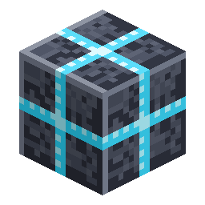

# Universal Pipe

<!-- nerospace:render -->
<p align="right"></p>
<!-- /nerospace:render -->

One pipe for everything: energy, fluids, gases and items flow through the same translucent tube — at
the same time.

## Overview

The Universal Pipe is the backbone of Nerospace logistics. Placed pipes auto-connect to each other and
to any machine, tank or inventory, forming a **network** that behaves as one shared system. All four
resource layers ride the same connection graph simultaneously:

| Layer | Colour | Rule |
| --- | --- | --- |
| Energy (FE) | red | shared pool, balanced across all segments |
| Fluid | blue | **one fluid per network** — the first fluid in claims it until drained |
| Gas | green | one gas per network; **breaking a pipe vents its gas** (visible puff) |
| Items | — | travel as **visible packets** (~2 blocks/s), round-robin between destinations |

## Obtaining

**Craft** (shaped, yields 8): a nerosteel sheath around a glass core —

```text
N N N
N G N
N N N
```

`N` = Nerosteel Ingot · `G` = Glass

## How it works

- **Connections:** the tube grows an arm toward anything it can talk to (pipes, machines, tanks,

  chests). Every face has an independent I/O mode **per layer**: Auto → In → Out → Off (set with the
  [Configurator](Configurator)). This includes the [Battery](Battery), [Fluid Tank](Fluid-Tank),
  [Gas Tank](Gas-Tank), [Item Store](Item-Store), and the void-sink [Trash Can](Trash-Can) — all
  now provided by [Neroland Core](Neroland-Core); the pipe bridges Core's
  `nerolandcore:fluid`/`nerolandcore:gas` (and energy/item) capabilities onto its own lookups, so
  it connects to them exactly as before (point an **OUT** face at the Trash Can to dump a stream).

- **Energy/fluid/gas:** the network pulls from providers, pushes to receivers and balances its own

  buffers — coloured pulse streams show what's flowing where.

- **Items:** pulling faces extract from inventories; packets physically travel through the tube,

  re-route at junctions, and **never spill** — if every destination is full they park and wait.
  Breaking a pipe drops the items inside it.

- **Filters & upgrades:** see [Pipe Filters and Upgrades](Pipe-Filters-and-Upgrades).
- **Readout:** right-click a pipe with an empty hand for its current contents; sneak-right-click with

  an empty hand pops installed upgrades out.

## Other mods' pipes and machines

The pipe is not limited to Nerospace blocks. On every loader it now both offers and reads the
platform's standard fluid and item handlers — the ones the wider tech-mod ecosystem uses — so a
Nerospace line and another mod's logistics meet in the middle:

- **Fluid:** an **Out** face pushes into another mod's tank or fluid machine, an **In** face pulls from

  one, and another mod's fluid pipe can drain or fill a Nerospace [Fluid Tank](Fluid-Tank),
  [Fuel Tank](Fuel-Tank), [Fuel Refinery](Fuel-Refinery), [Quarry Controller](Quarry-Controller),
  [Launch Controller](Launch-Controller) or Universal Pipe on its own — no Nerospace pipe needed
  anywhere in the line.

- **Items:** the same, both directions, for another mod's machines, crates and item pipes.
- **Energy** already crossed the mod boundary through [Neroland Core](Neroland-Core)'s shared network.
- **Gas does not.** There is no cross-mod standard for gas, and Nerospace's oxygen is not a fluid, so

  the green layer stops at the mod boundary — pipe oxygen between Nerospace (and Neroland) blocks only.

Face modes and [filters](Pipe-Filters-and-Upgrades) treat a foreign neighbour exactly like a Nerospace
one: set a face to **Off** with the [Configurator](Configurator) and another mod's pipe sees a shut face
there too, and a filtered face only passes what it is set to pass.

One honest caveat: this is Nerospace's half of the deal — it speaks the standard APIs. Whether a
particular other mod connects depends on that mod using them as well.

## Tips

One line can power a machine, feed it items and carry its outputs away at once — use face modes when
a single line serves both a source and a sink (set the source-side face to In so nothing flows back).

## Details

- ID: `nerospace:universal_pipe` · Tool: pickaxe, iron tier · Drops: itself
- Config: `energyPipeCapacity/Throughput`, `fluidPipe…`, `gasPipe…`, `itemPipeTicksPerBlock`,

  `itemPipeExtractAmount`, `itemPipeExtractPeriod`
