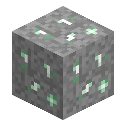

# Xertz Quartz Ore

<!-- nerospace:render -->

<!-- /nerospace:render -->

A pale-green crystal ore on **Greenxertz**, the mod's nether-quartz analogue.

## Overview

Xertz Quartz behaves like nether quartz: the ore drops the gem **directly** (no smelting required) and
is plentiful. It is a key crafting reagent, most notably for **Rocket Fuel Canisters**.

## Obtaining

- **Mining:** any pickaxe works. Drops **Xertz Quartz** directly (Fortune-affected). The ore can also

  be smelted into Xertz Quartz if you prefer.

- **Generation:** spawns abundantly across the **Greenxertz** dimension, uniformly between about

  **y 0 and y 110**.

## Use

- Craft **[Rocket Fuel Canisters](Items#rocket-fuel)** (with blaze powder, coal and iron).
- A general crafting gem with room to grow in future updates.

## Details

- ID: `nerospace:xertz_quartz_ore` · Dimension: Greenxertz
- Tool: any pickaxe · Drops: Xertz Quartz (gem)
